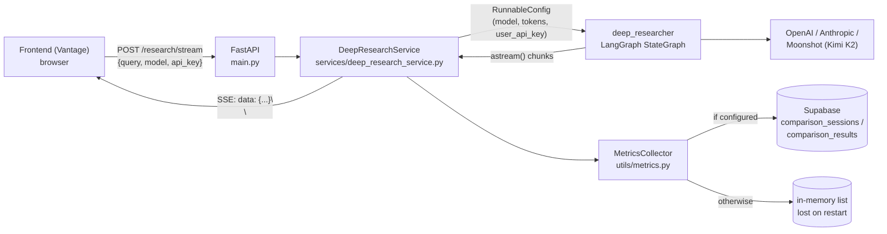
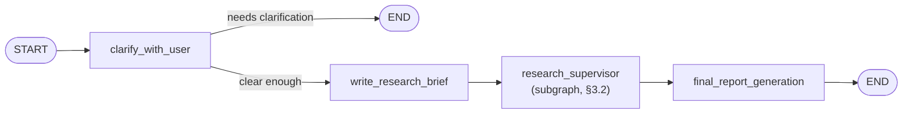
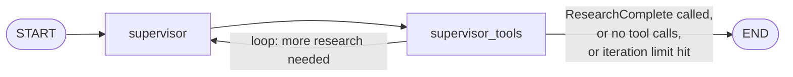
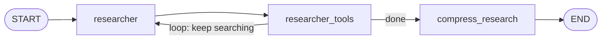
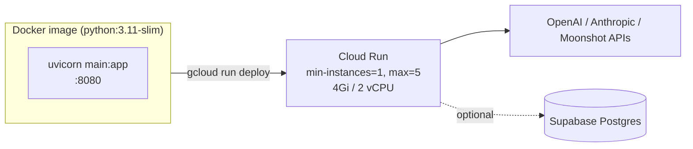

# Architecture

This document describes how the backend is actually built: the request lifecycle, the LangGraph research pipeline node-by-node, the configuration system, persistence, and known architectural limitations. For setup/usage, see [README.md](README.md).

## 1. System overview

The system has no database dependency by default. A single FastAPI process holds the LangGraph engine in memory; each request builds its own `RunnableConfig` carrying the caller's API key, so concurrent requests from different users with different keys/models are fully isolated from each other — nothing about the key or model choice is global state.

## 2. Request lifecycle — `POST /research/stream`

1. **`main.py`** validates the request body against `ResearchRequest` (Pydantic — `query`/`api_key` require `min_length=1`, `model` must be a valid `ModelType`), then does a redundant manual check for the same conditions (dead code in practice, since Pydantic already rejects malformed requests with `422` before the handler body runs).
2. A `research_id` is minted (`f"research_{int(time.time())}"`) and a `session_start` event is yielded immediately.
3. **`DeepResearchService.stream_research`** (`services/deep_research_service.py`) resolves the model ID (`"anthropic"`, `"openai"`, `"kimi"`) to its actual LangChain model string via `ModelService.get_model_provider_mapping()` (e.g. `"anthropic"` → `claude-sonnet-4-20250514`), and for `"kimi"` additionally points `ANTHROPIC_BASE_URL` at Moonshot's Anthropic-compatible endpoint.
4. It builds a `RunnableConfig` whose `configurable` dict sets `research_model`, `compression_model`, `summarization_model`, `final_report_model` (currently all pinned to the same resolved model), `user_api_key`, and forces `search_api: "anthropic"` regardless of `Configuration`'s own default (see [§4](#4-configuration--model-resolution)).
5. `deep_researcher.astream(input, config)` runs the graph (below). Each yielded chunk is inspected by node name and translated into one or more `StreamingEvent`s (`stage_start`, `stage_update`, `research_step`, `sources_found`, `research_complete`, `error`, …) via regex-based source extraction and content-length heuristics — there's no structured "event schema" the graph itself emits; the service infers meaning from which node just ran and what its output looks like.
6. Each `StreamingEvent` is serialized as `data: {json}\n\n` and yielded to the client as part of a `StreamingResponse`.
7. On completion (success or exception), `MetricsCollector.store_research_metrics` records duration/success — **in memory only**; this path never touches Supabase (see [§6](#6-persistence)).

The connection is a plain HTTP streaming response — the backend does not check `await request.is_disconnected()` inside the generator, so if the client aborts (e.g. the frontend's `AbortController` fires because the user navigated away), the backend keeps computing and calling the LLM provider to completion regardless; only the client-side socket is torn down early.

## 3. The research pipeline (LangGraph)

`open_deep_research/deep_researcher.py` defines three `StateGraph`s: the top-level graph, and two subgraphs it composes.

### 3.1 Top-level graph

- **`clarify_with_user`** — checks whether the query is answerable as-is. If not (and `allow_clarification` is enabled), it ends the turn with a clarifying question instead of proceeding; otherwise it routes straight to `write_research_brief`. Routing is done via LangGraph's `Command(goto=...)` return value, not static conditional edges.
- **`write_research_brief`** — turns the (possibly clarified) query into a structured research brief and initializes the supervisor's message history.
- **`research_supervisor`** — the subgraph in §3.2, doing the actual multi-tool research.
- **`final_report_generation`** — synthesizes the supervisor's collected notes into the final written report.

### 3.2 Supervisor subgraph — `research_supervisor`

- **`supervisor`** calls a model bound to three tools — `think_tool` (strategic reflection), `ConductResearch` (delegate a sub-question to a researcher), and `ResearchComplete` (declare the research phase done) — and always proceeds to `supervisor_tools`.
- **`supervisor_tools`** executes whatever the supervisor called. Every `ConductResearch` call in a turn spins up an **independent `researcher_subgraph.ainvoke(...)` run** and all of them execute concurrently via `asyncio.gather` — this is the actual mechanism behind "sub-agents run in parallel," not a marketing simplification. The loop exits back to `END` when the supervisor calls `ResearchComplete`, produces no tool calls, or exceeds `max_researcher_iterations` (default 6) — whichever comes first.

### 3.3 Researcher subgraph — one per `ConductResearch` delegation

- **`researcher`** calls a model bound to the configured search tool (native web search for OpenAI/Anthropic, or Tavily — see §4) plus `think_tool`/`ResearchComplete`, and routes to `researcher_tools`.
- **`researcher_tools`** executes search/tool calls (in parallel via `asyncio.gather` when multiple are requested in one turn) and loops back to `researcher`, or proceeds to `compress_research` once the sub-question is answered or `max_react_tool_calls` is hit.
- **`compress_research`** condenses this sub-researcher's raw findings into notes that flow back up to the supervisor, then `END`s the subgraph.

## 4. Configuration & model resolution

`open_deep_research/configuration.py` defines `Configuration` (a Pydantic model) with defaults for every knob in the graph — token limits, iteration counts, and `search_api` (defaulting to `SearchAPI.TAVILY`). At runtime, `Configuration.from_runnable_config(config)` merges: `RunnableConfig.configurable` values (highest precedence) → environment variables named after the field (`os.environ.get(field_name.upper())`) → the field's own default.

Two things worth knowing precisely:

- **`search_api` is always forced to `"anthropic"` for real traffic.** `deep_research_service.py` hardcodes `"search_api": "anthropic"` in every request's `RunnableConfig`, which overrides `Configuration`'s `TAVILY` default. The Tavily search tool (`open_deep_research/utils.py`) is fully implemented and shipped (`tavily-python`/`langchain-tavily` are real dependencies) but is dead code in this deployment — it only runs if something removes that hardcode.
- **API keys are per-request, not environment-global.** `configurable.user_api_key` — set from the caller's `api_key` field — is what every model call in the graph actually uses (`services/deep_research_service.py` → `RunnableConfig` → every node's `research_model_config["api_key"]`). `GET_API_KEYS_FROM_CONFIG` (default `"true"`, see the README) only affects the legacy environment-variable fallback path in `open_deep_research/utils.py`'s `get_tavily_api_key`, which — per the point above — is unreachable in normal operation.

## 5. Data models (`models/research_models.py`)

| Model | Used for |
|---|---|
| `ResearchRequest` | `{query, model, api_key}` — the incoming request body |
| `StreamingEvent` | One SSE frame — `type`, `stage`, `content`, `research_id`, `model`, `metadata`, `error` |
| `ComparisonSession` / `ComparisonResult` | One `/research/compare` run: session-level query/timestamp plus one result per model (duration, `stage_timings`, `sources_found`, `word_count`, `success`, `report_content`) |
| `ModelMetrics` / `ModelComparison` | Aggregated stats surfaced by `GET /research/comparison` |
| `AvailableModel` | Static per-model metadata returned by `GET /models` (from `ModelService`) |

## 6. Persistence

There are two, mostly-separate storage paths, both inside `utils/metrics.py`'s `MetricsCollector`:

- **Individual research runs** (`/research/stream`) → `store_research_metrics` → **always in-memory**, appended to a plain Python list. There is no code path that writes a single research run to Supabase. Restarting the process loses this history.
- **Comparison sessions** (`/research/compare`) → `store_comparison_session` → tries `SupabaseService` first (writes to the `comparison_sessions`/`comparison_results` tables — see [`database_migration/README.md`](database_migration/README.md)); falls back to the same in-memory list, tagged `{"type": "comparison_session", ...}`, if Supabase isn't configured.

Because both kinds of record share one in-memory list with different shapes, code that iterates it (`get_research_history`, `delete_research`) has to explicitly guard against the shape mismatch (filtering on `"research_id" in item` / using `.get()` instead of `[...]`) rather than assuming a uniform record type.

## 7. Deployment topology

The Dockerfile installs from `requirements.lock` (a fully pinned snapshot) rather than `requirements.txt` directly, so a rebuild months later doesn't silently pick up breaking dependency updates. See the README's Docker section for how to regenerate the lock file.

## 8. Security posture

Summarized here because it shapes several architectural decisions above (per-request keys, no server-side key storage); full detail is in the [README's Security notes](README.md#-security-notes). In short: CORS is currently `allow_origins=["*"]`, there's no authentication or rate limiting on any endpoint, and `/research/test` is an ungated debug endpoint — none of this blocks local development, but all of it matters before a public deployment.

## 9. Known architectural limitations

- **No backpressure on client disconnect** — the graph runs to completion server-side even after the client aborts (§2). At scale this wastes LLM spend on abandoned requests.
- **Tavily search is dead code** — fully implemented, never reached (§4). Either wire it up as a real user-facing choice or remove it; right now it's maintenance surface with no function.
- **Individual research history doesn't survive a restart or scale-to-zero** — by design today, but worth knowing before relying on `/research/history` for anything durable (§6).
- **Mixed-shape in-memory list** — comparison sessions and individual runs share one Python list with different fields; any new code touching `research_history` needs to handle both shapes explicitly (§6).
- **Model routing is currently hardcoded to Anthropic's model family shape** for compression/summarization/final-report models (all set to the same resolved model as the main research model) — there's no support today for mixing providers within a single research run.
